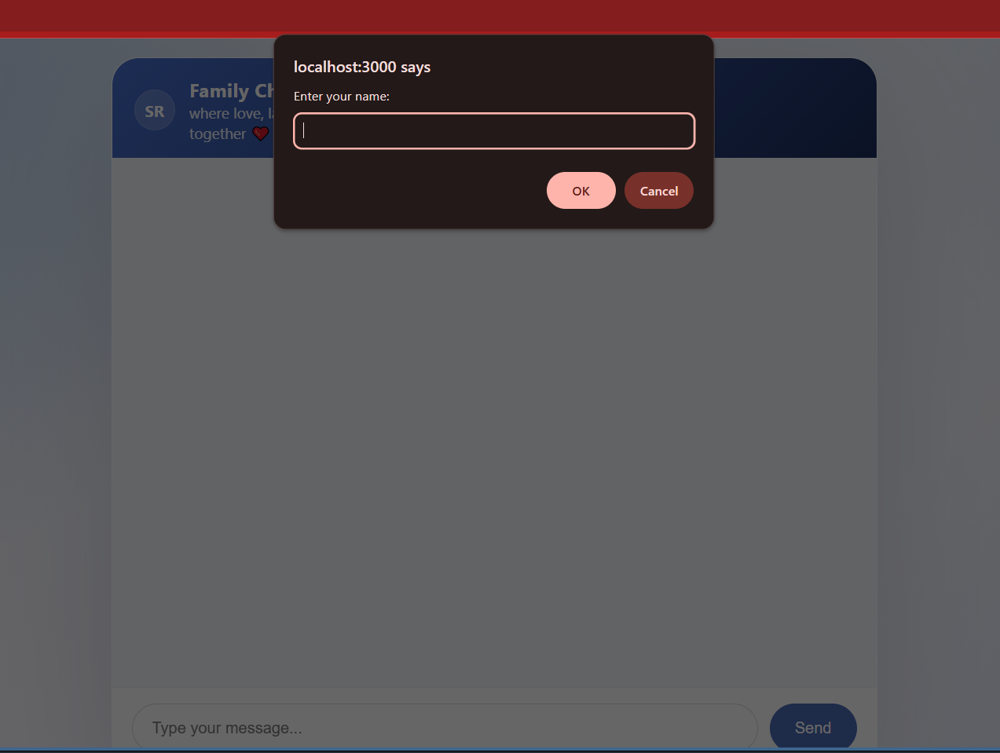
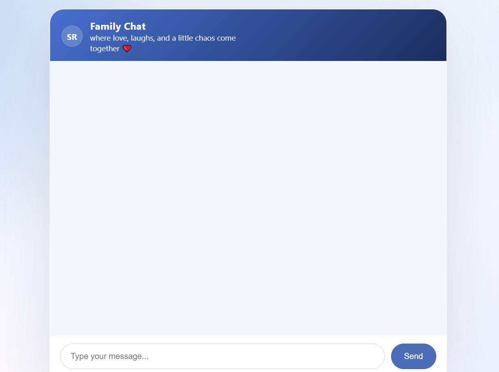
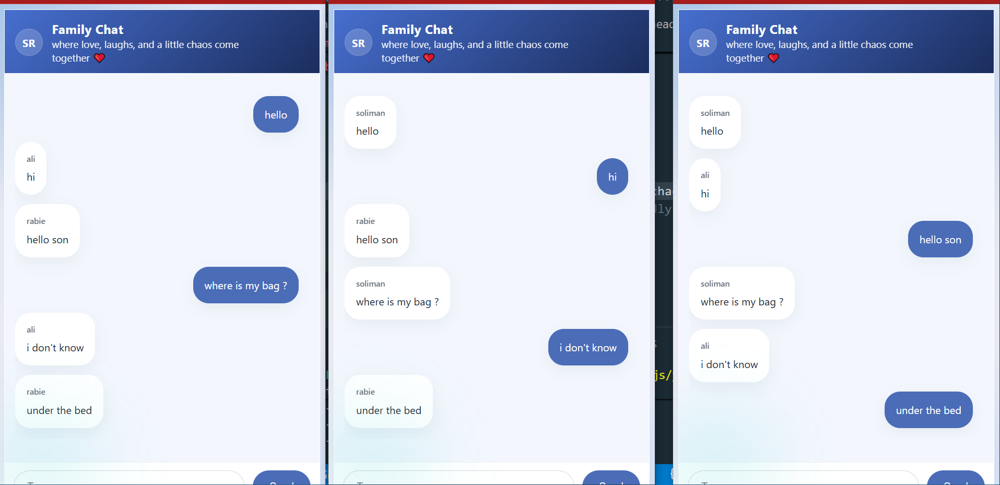
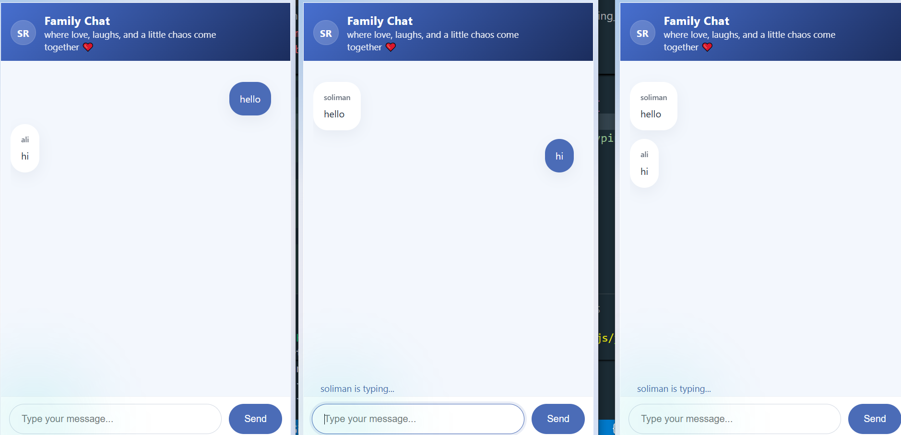

# 💬 Real-Time Chat App with Socket.IO

A modern real-time chat application built using Node.js, Express, and Socket.IO.  
Users can chat instantly across multiple devices with live typing status.

## 🚀 Features

- Real-time messaging
- Multi-device chat support
- Typing indicator
- Responsive modern UI
- Built with Socket.IO
- Fast and lightweight server

## 📸 Screenshots

### Start Page



### Home Screen



### Chat UI



### Typing Status



## 🛠️ Tech Stack

- Node.js
- Express.js
- Socket.IO
- HTML5
- CSS3
- JavaScript

## 📂 Project Structure

chat-app/
│── server.js
│── index.html
│── package.json
│── .gitignore

## ⚙️ Installation

Clone the repository:

```bash
git clone https://github.com/SolimanRabie/Chat-App.git
```
